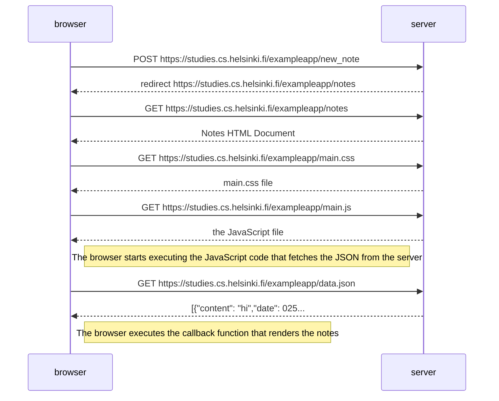

```mermaid
sequenceDiagram

    browser->>server: POST https://studies.cs.helsinki.fi/exampleapp/new_note
    server-->>browser: redirect https://studies.cs.helsinki.fi/exampleapp/notes

    browser->>server: GET https://studies.cs.helsinki.fi/exampleapp/notes
    server-->>browser: Notes HTML Document

    browser->>server: GET https://studies.cs.helsinki.fi/exampleapp/main.css
    server-->>browser: main.css file

    browser->>server: GET https://studies.cs.helsinki.fi/exampleapp/main.js
    server-->>browser: the JavaScript file

    Note right of browser: The browser starts executing the JavaScript code that fetches the JSON from the server

    browser->>server: GET https://studies.cs.helsinki.fi/exampleapp/data.json
    server-->>browser: [{"content": "hi","date": 025...

    Note right of browser: The browser executes the callback function that renders the notes
```