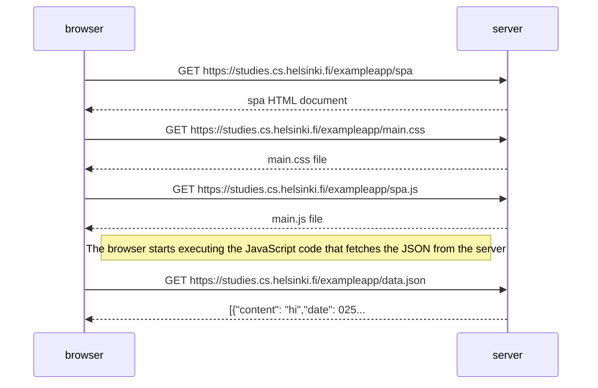

```mermaid
sequenceDiagram

    browser->>server: GET https://studies.cs.helsinki.fi/exampleapp/spa
    server-->>browser: spa HTML document

    browser->>server: GET https://studies.cs.helsinki.fi/exampleapp/main.css
    server-->>browser: main.css file

    browser->>server: GET https://studies.cs.helsinki.fi/exampleapp/spa.js
    server-->>browser: main.js file

    Note right of browser: The browser starts executing the JavaScript code that fetches the JSON from the server

    browser->>server: GET https://studies.cs.helsinki.fi/exampleapp/data.json
    server-->>browser: [{"content": "hi","date": 025...
```